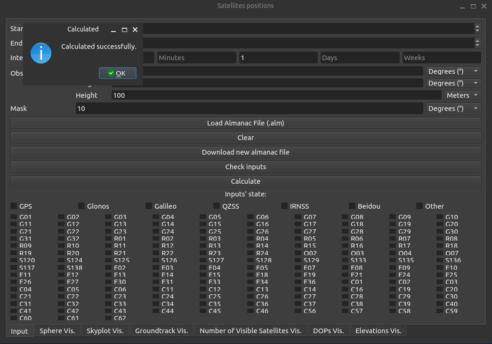

# Satevis

## Description

Python appplication that visualises positions of satelites and related statistics

## Quick start

1. Download zipped repository and unpack it.
2. Run app.py
3. Click "Download new almanac file"
4. Click "Load Almanac File (.alm)" and choose the downloaded file.
5. Click "Calculate"
6. Explore other tabs at the bottom of the app!

### Dependencies

- numpy
- wget
- matplotlib
- PyQt6

### Installing

### Executing program

## Help

Any advise for common problems or issues.
```
command to run if program contains helper info
```

## Authors

Contributors names and contact info

## Version History

## License

This project is licensed under the Apache License - see the LICENSE file for details



